## Table of Contents
- [Gra: Podzial na pol](#gra-podzial-na-pol)
- [FuzzyLogic: Ocena ryzyka jazdy + animacja (zastosowanie w praktyce)](#fuzzylogic-ocena-ryzyka-jazdy--animacja-zastosowanie-w-praktyce)
- [Clustering: Rekomendacja filmow](#clustering-rekomendacja-filmow)
- [Klasyfikacja](#klasyfikacja)

---

## Gra: Podzial na pol
## Zjazd 1

**Folder:** `Zjazd1_PodzialNaPol`

### Wymagane biblioteki
1. math
2. matplotlib
3. easyAI
4. tabulate

### Zasady:
1. Gra zaczyna się od ustalonej liczby (np. 1000)
2. Gracze na zmianę dzielą aktualną liczbę przez **2**, **3** lub **4** (Wynik dzielenia jest zawsze zaokrąglany w dół)
3. Gracz, który nie może wykonać poprawnego podziału, gdy liczba wynosi **1**, przegrywa grę
4. Jeśli gracz wybierze dzielnik, który spowodowałby wynik równy **zero**, przegrywa
5. Gra trwa, dopóki jeden z graczy nie zmusi przeciwnika do sytuacji, w której nie można wykonać ruchu

### Przykład gry:
- Początkowa liczba: **100**
- Gracz 1 dzieli przez **4**: wynik to **25**
- Gracz 2 dzieli przez **3**: wynik to **8**
- Gra trwa, aż jeden z graczy nie będzie w stanie wykonać ruchu.

## Screenshot z gry
### Gamplay
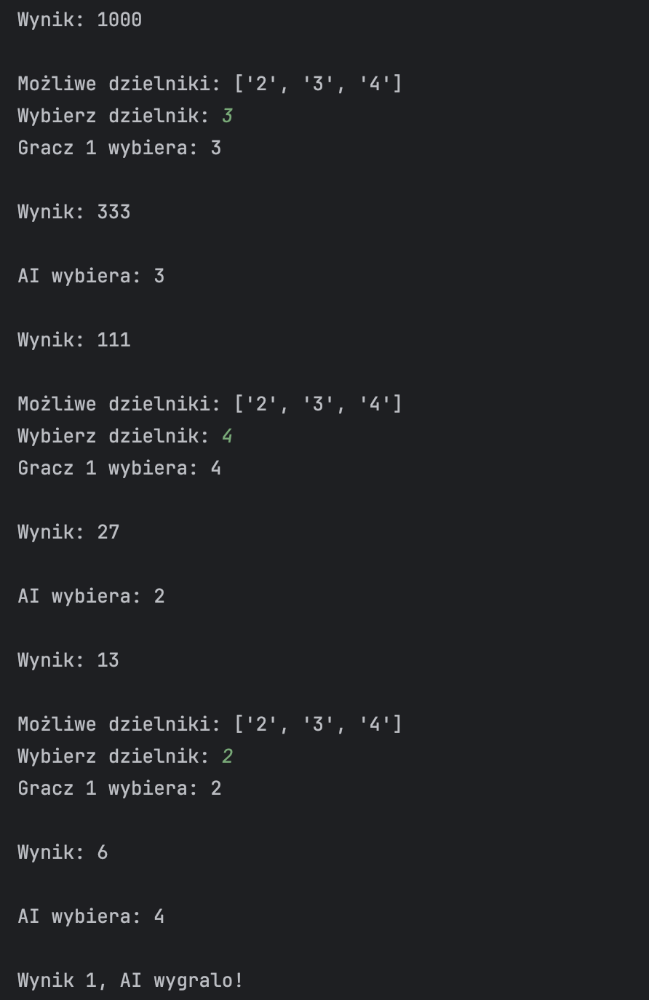
### Historia gry
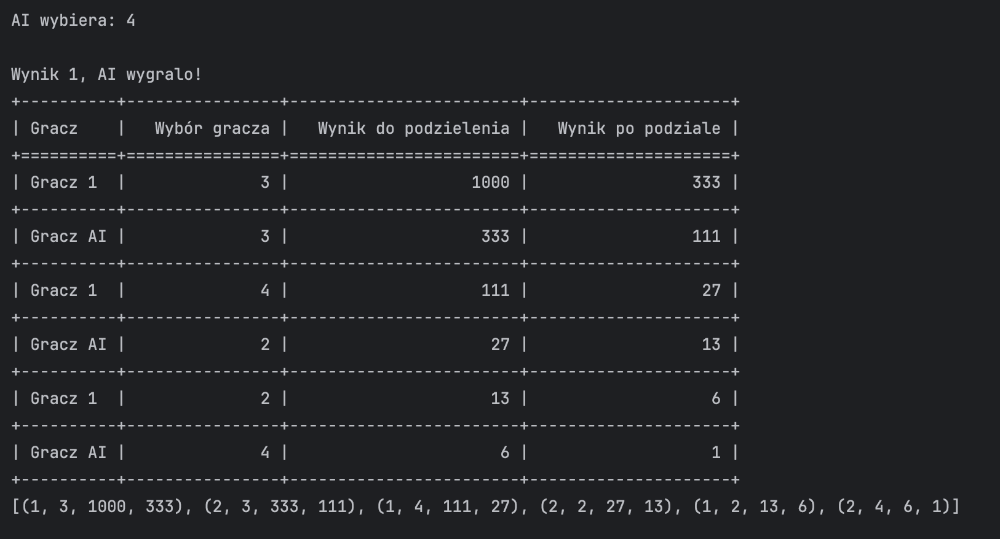
### Wykres historii gry
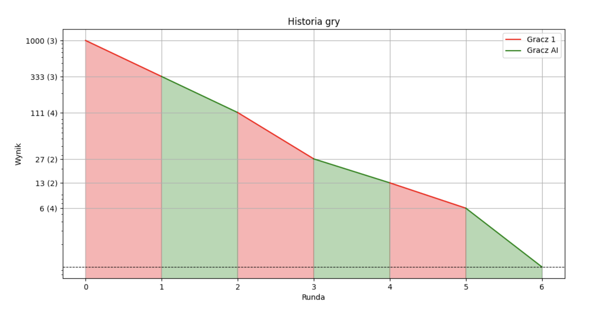

---

## FuzzyLogic: Ocena ryzyka jazdy + animacja (zastosowanie w praktyce)
## Zjazd 2

**Folder:** `Zjazd2_WarunkiJazdy_FuzzyLogic`

### Wymagane biblioteki
1. numpy
2. skfuzzy as fuzz
3. skfuzzy import control as ctrl
4. networkx
5. matplotlib.pyplot
6. pygame
7. sys

### Problem:
- Ocena ryzyka jazdy na podstawie widoczności, intensywności opadów i natężenia ruchu.
- Animacja przejazdu samochodu na podstawie oceny ryzyka jazdy.

## Screenshoty z FuzzyLogic
### Przykłady wystąpień ryzyka
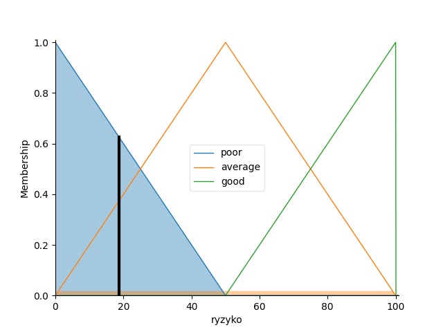
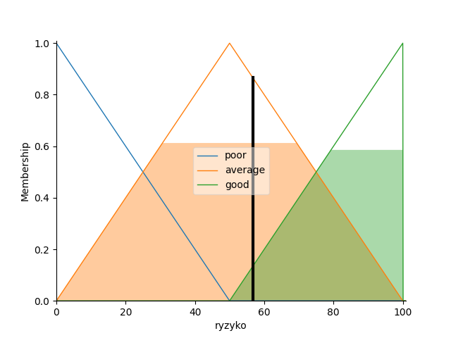
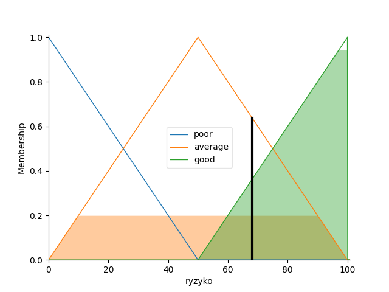
### Przykłady wywołania systemu - zrzut ekranu
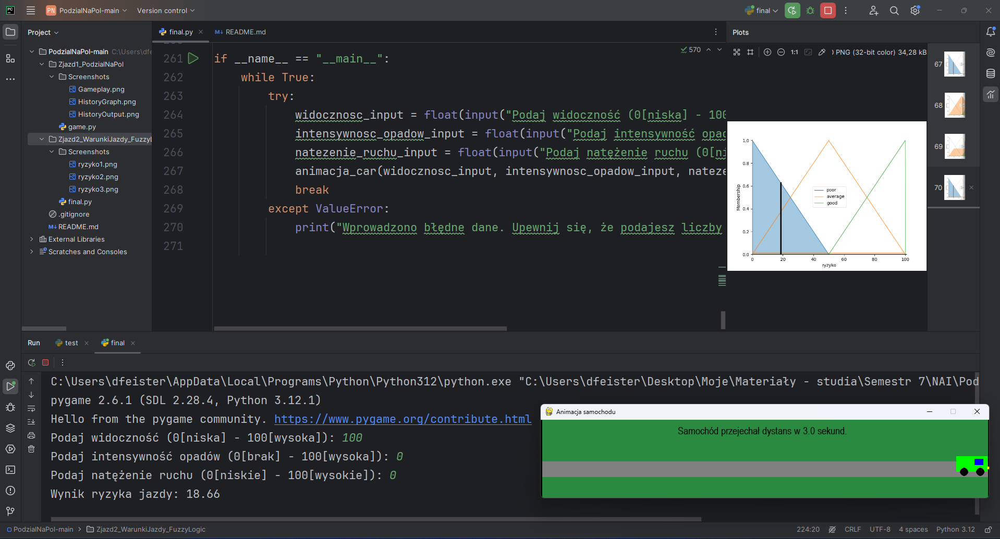
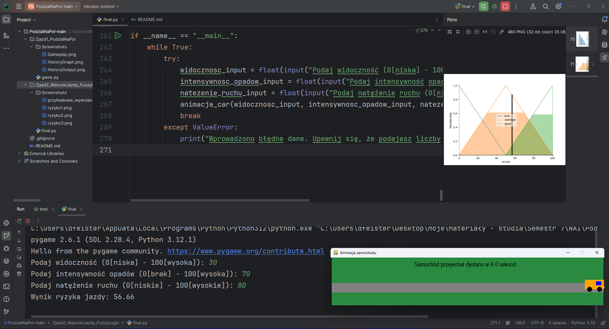
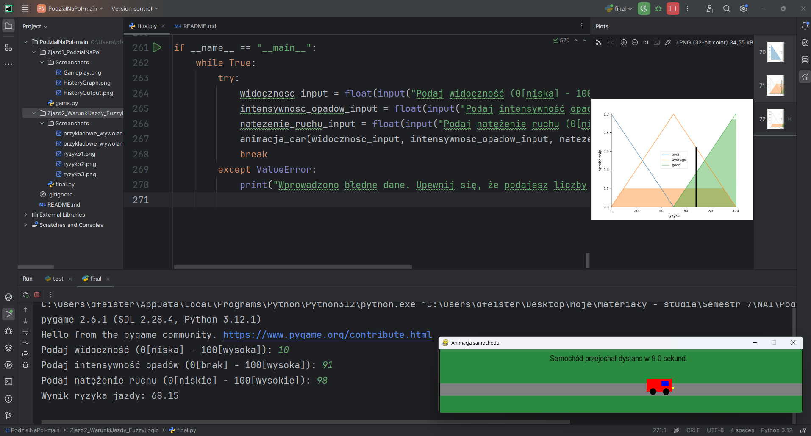

## Nagranie animacji


---

## Clustering: Rekomendacja filmow
## Zjazd 3

**Folder:** `Zjazd3_Rekomendacja_filmów`

### Wymagane biblioteki
1. numpy
2. argparse
3. json
4. sklearn
5. scipy

### Problem:
System rekomendacji i antyrekomendacji filmów z wykorzystaniem klasteryzacji i metod podobieństw.

Moduł zawiera implementację systemu rekomendacji filmowych, który grupuje użytkowników na podstawie wspólnych filmów
i kategorii, a następnie generuje rekomendacje i antyrekomendacje dla wybranego użytkownika. System uwzględnia różne
metody obliczania podobieństwa między użytkownikami, takie jak odległość Euklidesowa i korelacja Pearsona, oraz
wykorzystuje algorytm k-średnich (k-means) do grupowania użytkowników.

## Screenshoty
### Rekomendacji


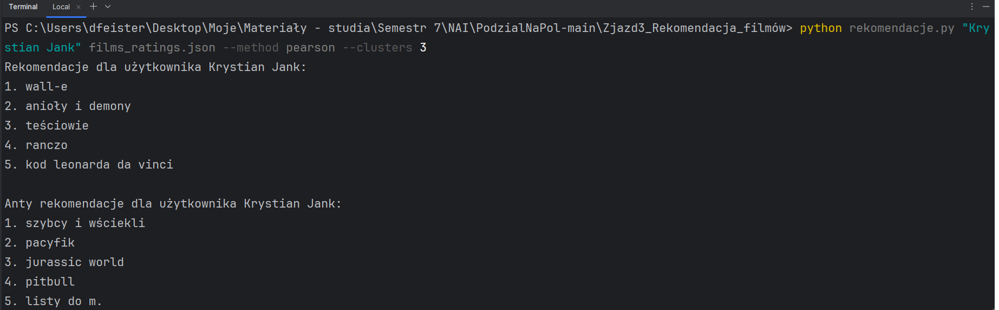

### Rekomendacji z opisem i datą wydania (Bonus)
Wykorzystanie API [TMDB](https://www.themoviedb.org)
```terminal
python rekomendacje.py "Dawid Feister" films_ratings.json --method euclidean --clusters 3 --api <api>
```
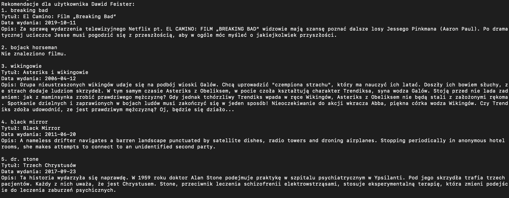

### Porównanie rekomendacji dwoma metrykami (Bonus)
Porównywanie dwóch metryk `uclidean` oraz `pearson`
```terminal
python rekomendacje.py "Dawid Feister" films_ratings.json --method euclidean --clusters 3 --compare
python rekomendacje.py "Paweł Czapiewski" films_ratings.json --method euclidean --clusters 3 --compare
```
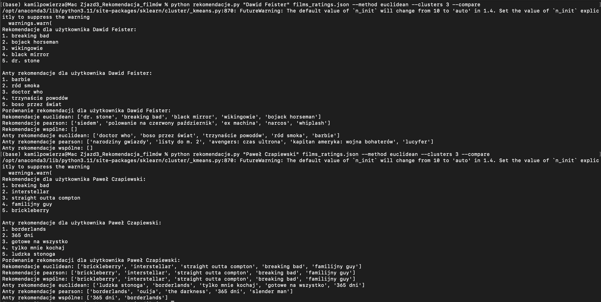

---

## Klasyfikacja
## Zjazd 4

**Folder:** `Zjazd4_Klasyfikacja`

### Problem
Projekt polega na klasyfikacji mieszkań w Bostonie na podstawie cech:
- `CRIM`: Wskaźnik przestępczości na mieszkańca w danej miejscowości.
- `ZN`: Procent terenów mieszkalnych przeznaczonych na działki większe niż 25,000 stóp kwadratowych.
- `INDUS`: Procent gruntów przeznaczonych na przemysł nienależący do sektora detalicznego w danej miejscowości.
- `CHAS`: Zmienna binarna wskazująca, czy dany obszar graniczy z rzeką Charles (1 = tak, 0 = nie).
- `NOX`: Stężenie tlenków azotu (w częściach na 10 milionów).
- `RM`: Średnia liczba pokoi w mieszkaniach w danej miejscowości.
- `AGE`: Procent jednostek mieszkalnych posiadających właściciela, które zostały wybudowane przed 1940 rokiem.
- `DIS`: Wazona odległość do pięciu głównych ośrodków zatrudnienia w Bostonie.
- `RAD`: Indeks dostępności do dróg promieniowych.
- `TAX`: Stawka podatku od nieruchomości (wartość nieruchomości na $10,000).
- `PTRATIO`: Stosunek liczby uczniów do nauczycieli w danej miejscowości.
- `B`: Wzór: 1000 * (Bk - 0.63)^2, gdzie Bk to proporcja ludności czarnoskórej w danej miejscowości.
- `LSTAT`: Procent ludności o niższym statusie społecznym.
- `MEDV`: Mediana wartości domów właścicieli w tysiącach dolarów.

[Źródło](https://machinelearningmastery.com/standard-machine-learning-datasets/)

### Drzewo decyzyjne
Na podstawie mediany ceny mieszkań `MEDV` dane są klasyfikowane na dwie grupy: `niską (0)` i `wysoką (1)` cenę. `Drzewo decyzyjne` jest trenowane na przygotowanych danych i wykorzystywane do `przewidywania klasy dla nowych danych`. Skrypt zawiera także `wizualizację drzewa decyzyjnego` oraz `ocenę modelu`, w tym `dokładność klasyfikacji` oraz `raport z wynikami klasyfikacji`.

### Screenshoty
#### Wizualizacja Drzewa Decyzyjnego
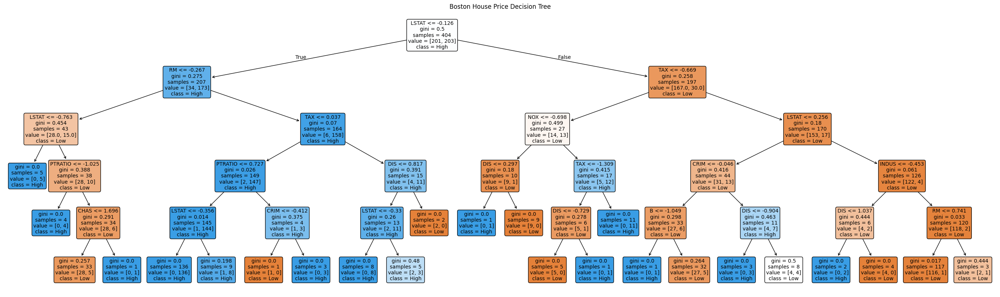
#### Dokładność drzewa i przykładowe użycie
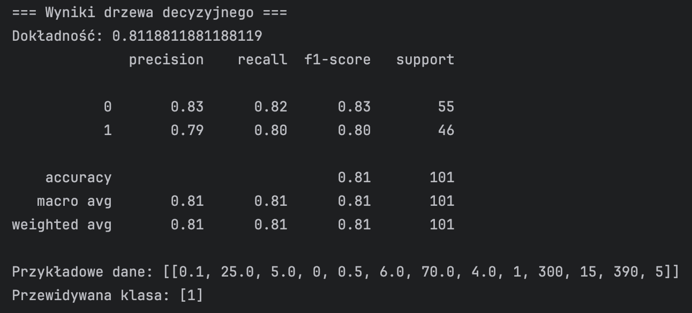