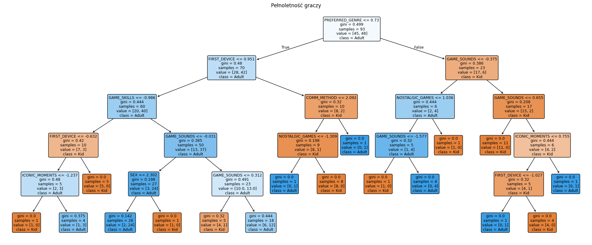
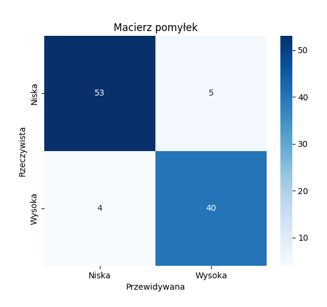
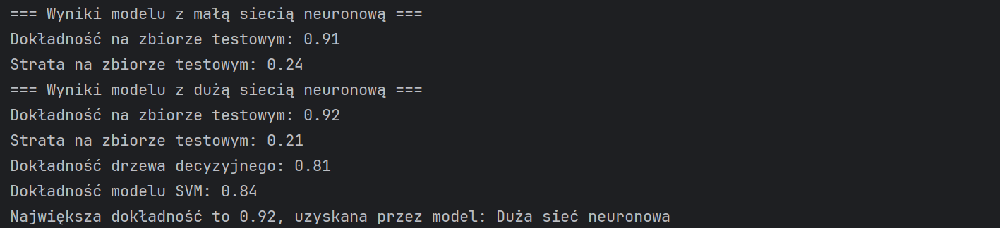
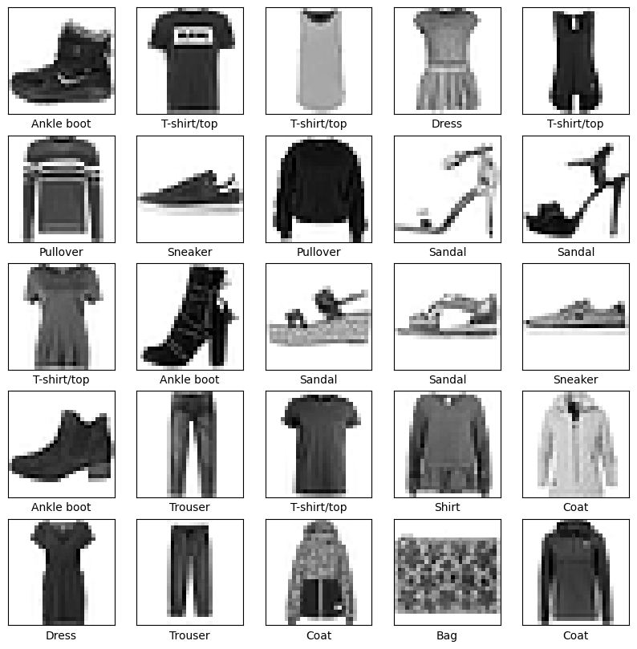

## Table of Contents
- [Zjazd 1 | Gra: Podzial na pol](#zjazd-1--gra-podzial-na-pol)
- [Zjazd 2 | FuzzyLogic: Ocena ryzyka jazdy + animacja (zastosowanie w praktyce)](#zjazd-2--fuzzylogic-ocena-ryzyka-jazdy--animacja-zastosowanie-w-praktyce)
- [Zjazd 3 | Clustering: Rekomendacja filmow](#zjazd-3--clustering-rekomendacja-filmow)
- [Zjazd 4 | Klasyfikacja](#zjazd-4--klasyfikacja)
- [Zjazd 5 | Sieć neuronowa](#zjazd-5--sieć-neuronowa)

---

# Zjazd 1 | Gra: Podzial na pol

**Folder:** `Zjazd1_PodzialNaPol`

## Wymagane biblioteki
1. math
2. matplotlib
3. easyAI
4. tabulate

## Zasady:
1. Gra zaczyna się od ustalonej liczby (np. 1000)
2. Gracze na zmianę dzielą aktualną liczbę przez **2**, **3** lub **4** (Wynik dzielenia jest zawsze zaokrąglany w dół)
3. Gracz, który nie może wykonać poprawnego podziału, gdy liczba wynosi **1**, przegrywa grę
4. Jeśli gracz wybierze dzielnik, który spowodowałby wynik równy **zero**, przegrywa
5. Gra trwa, dopóki jeden z graczy nie zmusi przeciwnika do sytuacji, w której nie można wykonać ruchu

## Przykład gry:
- Początkowa liczba: **100**
- Gracz 1 dzieli przez **4**: wynik to **25**
- Gracz 2 dzieli przez **3**: wynik to **8**
- Gra trwa, aż jeden z graczy nie będzie w stanie wykonać ruchu.

## Screenshoty z gry
### Gamplay

### Historia gry

### Wykres historii gry


---

# Zjazd 2 | FuzzyLogic: Ocena ryzyka jazdy + animacja (zastosowanie w praktyce)

**Folder:** `Zjazd2_WarunkiJazdy_FuzzyLogic`

## Wymagane biblioteki
1. numpy
2. skfuzzy as fuzz
3. skfuzzy import control as ctrl
4. networkx
5. matplotlib.pyplot
6. pygame
7. sys

## Problem:
- Ocena ryzyka jazdy na podstawie widoczności, intensywności opadów i natężenia ruchu.
- Animacja przejazdu samochodu na podstawie oceny ryzyka jazdy.

## Screenshoty z FuzzyLogic
### Przykłady wystąpień ryzyka


### Przykłady wywołania systemu - zrzut ekranu


## Nagranie animacji


---

# Zjazd 3 | Clustering: Rekomendacja filmow

**Folder:** `Zjazd3_Rekomendacja_filmów`

## Wymagane biblioteki
1. numpy
2. argparse
3. json
4. sklearn
5. scipy

## Problem:
System rekomendacji i antyrekomendacji filmów z wykorzystaniem klasteryzacji i metod podobieństw.

Moduł zawiera implementację systemu rekomendacji filmowych, który grupuje użytkowników na podstawie wspólnych filmów
i kategorii, a następnie generuje rekomendacje i antyrekomendacje dla wybranego użytkownika. System uwzględnia różne
metody obliczania podobieństwa między użytkownikami, takie jak odległość Euklidesowa i korelacja Pearsona, oraz
wykorzystuje algorytm k-średnich (k-means) do grupowania użytkowników.

## Screenshoty
### Rekomendacji


### Rekomendacji z opisem i datą wydania (Bonus)
Wykorzystanie API [TMDB](https://www.themoviedb.org)
```terminal
python rekomendacje.py "Dawid Feister" films_ratings.json --method euclidean --clusters 3 --api <api>
```


### Porównanie rekomendacji dwoma metrykami (Bonus)
Porównywanie dwóch metryk `uclidean` oraz `pearson`
```terminal
python rekomendacje.py "Dawid Feister" films_ratings.json --method euclidean --clusters 3 --compare
python rekomendacje.py "Paweł Czapiewski" films_ratings.json --method euclidean --clusters 3 --compare
```


---

# Zjazd 4 | Klasyfikacja

**Folder:** `Zjazd4_Klasyfikacja`
- [Problem Boston House Price](#problem-boston-house-price)
  - [Drzewo decyzyjne](#drzewo-decyzyjne)
  - [SVM (SVC)](#svm-svc)
- [Problem przewidywania wieku Abalone](#problem-przewidywania-wieku-abalone)
  - [Drzewo decyzyjne](#drzewo-decyzyjne-1)
  - [SVM (SVC)](#svm-svc-1)
- [Bonus](#bonus)
  - [Drzewo decyzyjne](#wizualizacja-drzewa-decyzyjnego-2)
  - [SVM (SVC)](#svm)

## Problem Boston House Price
Projekt polega na klasyfikacji mieszkań w Bostonie na podstawie cech:
- `CRIM`: Wskaźnik przestępczości na mieszkańca w danej miejscowości.
- `ZN`: Procent terenów mieszkalnych przeznaczonych na działki większe niż 25,000 stóp kwadratowych.
- `INDUS`: Procent gruntów przeznaczonych na przemysł nienależący do sektora detalicznego w danej miejscowości.
- `CHAS`: Zmienna binarna wskazująca, czy dany obszar graniczy z rzeką Charles (1 = tak, 0 = nie).
- `NOX`: Stężenie tlenków azotu (w częściach na 10 milionów).
- `RM`: Średnia liczba pokoi w mieszkaniach w danej miejscowości.
- `AGE`: Procent jednostek mieszkalnych posiadających właściciela, które zostały wybudowane przed 1940 rokiem.
- `DIS`: Wazona odległość do pięciu głównych ośrodków zatrudnienia w Bostonie.
- `RAD`: Indeks dostępności do dróg promieniowych.
- `TAX`: Stawka podatku od nieruchomości (wartość nieruchomości na $10,000).
- `PTRATIO`: Stosunek liczby uczniów do nauczycieli w danej miejscowości.
- `B`: Wzór: 1000 * (Bk - 0.63)^2, gdzie Bk to proporcja ludności czarnoskórej w danej miejscowości.
- `LSTAT`: Procent ludności o niższym statusie społecznym.
- `MEDV`: Mediana wartości domów właścicieli w tysiącach dolarów.

[Źródło](https://machinelearningmastery.com/standard-machine-learning-datasets/)

### Drzewo decyzyjne
Na podstawie mediany ceny mieszkań `MEDV` dane są klasyfikowane na dwie grupy: `niską (0)` i `wysoką (1)` cenę. `Drzewo decyzyjne` jest trenowane na przygotowanych danych i wykorzystywane do `przewidywania klasy dla nowych danych`. Skrypt zawiera także `wizualizację drzewa decyzyjnego` oraz `ocenę modelu`, w tym `dokładność klasyfikacji` oraz `raport z wynikami klasyfikacji`.

### Wizualizacja Drzewa Decyzyjnego

### Dokładność drzewa i przykładowe użycie


### SVM (SVC)
Na podstawie mediany ceny mieszkań `MEDV` dane są klasyfikowane na dwie grupy: `niską (0)` i `wysoką (1)` cenę. `SVM` jest trenowany na przygotowanych danych i wykorzystywany do `przewidywania klasy dla nowych danych`. Skrypt zawiera także `wizualizację SVC` oraz `ocenę modelu`, w tym `dokładność klasyfikacji` oraz `raport z wynikami klasyfikacji`.

### Wizualizacja SVM

### Dokładność SVC i przykładowe użycie


## Problem przewidywania wieku Abalone
Projekt polega na `klasyfikacji wieku muszli abalonów` na podstawie różnych `cech fizycznych`, takich jak `wymiary`, `wagi` i `płeć muszli`.\
Wartość `Rings` reprezentuje `liczbę pierścieni` na muszli, co odpowiada jej wiekowi.\
Poniżej opis parametrów w bazie:
- `Sex`: Płeć muszli. Może przyjąć wartości M = 0 (mężczyzna), F = 1 (kobieta) lub I = 2 (niemowlę).
- `Length`: Długość muszli, mierzona w milimetrach (mm), będąca najdłuższym wymiarem muszli.
- `Diameter`: Średnica muszli, mierzona w milimetrach (mm), w kierunku prostopadłym do długości.
- `Height`: Wysokość muszli wraz z mięsem, mierzona w milimetrach (mm).
- `Whole weight`: Całkowita waga muszli, mierzona w gramach (g), obejmująca muszlę oraz mięso.
- `Shucked weight`: Waga samego mięsa, mierzona w gramach (g), po oddzieleniu od muszli.
- `Viscera weight`: Waga wnętrzności muszli, mierzona w gramach (g), po usunięciu wnętrzności.
- `Shell weight`: Waga muszli, mierzona w gramach (g), po wysuszeniu.
- `Rings`: Liczba pierścieni na muszli. To cecha, którą chcemy przewidywać.

[Źródło](https://archive.ics.uci.edu/dataset/1/abalone)

### Drzewo decyzyjne
Na podstawie `mediany` ilości pierścieni dane są `klasyfikowane` na dwie grupy: `Younger (0)` i `Older (1)`, definiując wiek Abalone.\
`Drzewo decyzyjne` jest trenowane na przygotowanych danych i wykorzystywane do przewidywania klasy dla nowych danych. \
Skrypt zawiera także `wizualizację` drzewa decyzyjnego oraz `ocenę modelu`, w tym `dokładność klasyfikacji` oraz `raport z wynikami klasyfikacji`.

Płeć w danych są przeliczane w postaci `"M": 0, "F": 1, "I": 2`.

### Wizualizacja Drzewa Decyzyjnego

### Dokładność Drzewa Decyzyjnego i przykładowe użycie
Dane mogą być podane w postaci:
```terminal
    [['0',0.39,0.31,0.1,0.406,0.1745,0.093,0.125]]
```
Lub
```terminal
    [['m',0.39,0.31,0.1,0.406,0.1745,0.093,0.125]]
```


### SVM (SVC)
Na podstawie `mediany` ilości pierścieni dane są `klasyfikowane` na dwie grupy: `Younger (0)` i `Older (1)`, definiując wiek Abalone.\
`Model SVC` jest trenowany na przygotowanych danych i wykorzystywane do przewidywania klasy dla nowych danych. \
Skrypt zawiera także `wizualizację` klasyfikacji SVC oraz `ocenę modelu`, w tym `dokładność klasyfikacji` oraz `raport z wynikami klasyfikacji`.
`BONUS` skrypt zawiera użycie różnych rodzaji kernel function z różnymi parametrami.

Płeć w danych są przeliczane w postaci `"M": 0, "F": 1, "I": 2`.

### Wizualizacja SVM

### Dokładność SVC i przykładowe użycie
Dane mogą być podane w postaci:
```terminal
    [[0,0.39,0.31,0.1,0.406,0.1745,0.093,0.125]]
```


## Bonus
Stworzyliśmy ankietę wsród graczy.\
Link do ankiety: [Ankieta](https://forms.gle/VGM7HoqHYkRwqTNn9) \
Zebraliśmy 20 różnych informacji na podstawie, których model będzie w stanie przewidzieć czy osoba odpowiadająca na 12 z nich jest pełnoletnia.
50% danych do nauczenia modelu są osobami pełnoletnimi a drugie 50% to osoby niepełnoletnie.\
Odpowiedzi nie były weryfikowane, czyt. nie sprawdzaliśmy czy dana osoba faktycznie ma daną ilość sprzętu czy też sprawdzaliśmy wiek dokumentem tożsamości itd.\
Zaufaliśmy że wszystkie 120 osób odpowiedziało prawidłowo.
        
Rozwinięcie skrótów:
1. `AGE`: Ile masz lat? (Podaj wiek)\
    [Integer]
2. `SEX`: Jaka jest Twoja płeć?\ 
    0: Mężczyzna\
    1: Kobieta\
    2: Inna
3. `PREFERRED_GENRE`: Jaki gatunek gier preferujesz?\
    0: Strzelanki\
    1: Battle Royale\
    2: Gry RPG; Souls Like\
    3: Gry strategiczne\
    4: Symulatory\
    5: Gry logiczne\
    6: Gry przygodowe\
    7: Inne
4. `USE_MODS`: Czy używasz modów do gier?\
    0: Tak, często\
    1: Okazjonalnie\
    2: Nie
5. `DEVICE`: Na jakim sprzęcie grasz najczęściej?\
    0: PC\
    1: Konsola (PS/Xbox)\
    2: Mobilne urządzenia\
    3: Inne
6. `DEVICES_COUNT`: Z ilu sprzętów korzystasz do grania? (Podaj ilość)\
    [Integer] Przedział od 0 do 10, gdzie 10 to 10 lub więcej.
7. `PLATFORM`: Na jakiej platformie grasz najczęściej?\
    0: Steam\
    1: Origin\
    2: Epic Games\
    3: Inne
8. `PLAY_TIME`: Ile czasu dziennie średnio spędzasz na grach (Podaj w godzinach)?\
    [Integer] Przedział od 0 do 10, gdzie 10 to 10 lub więcej.
9. `PLAY_TIME_OF_DAY`: O jakiej porze dnia preferujesz granie?\
    0: Rano\
    1: Po południe\
    2: Wieczór\
    3: Późna noc
10. `GAME_MODE`: Jaki tryb gry preferujesz?\
    0: Gra lokalna (Singleplayer)\
    1: Gra online (Multiplayer)
11. `VOICE_CHAT_START`: Kiedy zacząłeś/aś używać czatu głosowego w grach komputerowych?\
    0: Nigdy\
    1: Przed 2000\
    2: 2000–2010\
    3: 2010–2020\
    4: Po 2020
12. `FAV_GAME`: Jaką gre lubisz najbardziej? (Wybierz jedną)\
    0: Counter Strike (2, Global Offensive)\
    1: Valorant\
    2: Fortnite\
    3: Minecraft\
    4: League of Legends\
    5: The Sims 4\
    6: FIFA (np. FIFA 24)\
    7: Call of Duty\
    8: Roblox\
    9: GTA V\
    10: Mario\
    11: Zelda\
    12: Pokémon\
    13: Inna
13. `VISUAL_IMPACT`: Która z poniższych gier wywarła na Tobie największe wrażenie wizualne? (Wybierz jedną)\
    0: Mario\
    1: The Legend of Zelda: Breath of the Wild\
    2: Final Fantasy\
    3: Half-Life 2\
    4: Vrchat\
    5: Fortnite\
    6: The Witcher 3: Wild Hunt\
    7: Horizon Zero Dawn\
    8: Cyberpunk 2077\
    9: GTA 5\
    10: Inne
14. `COMM_METHOD`: W jakiej formie najczęściej komunikujesz się z innymi podczas grania?\
    0: Discord\
    1: TeamSpeak\
    2: Inne
15. `GAME_SKILLS`: Jak oceniasz swoje umiejętności w grach komputerowych?\
    0: Bardzo zaawansowane\
    1: Średnio zaawansowane\
    2: Podstawowe\
    3: Brak umiejętności
16. `FOLLOW_ESPORTS`: Czy śledzisz esport lub zawody gamingowe?\
    0: Tak, regularnie\
    1: Tak, sporadycznie\
    2: Nie, nie interesuje mnie to
17. `NOSTALGIC_GAMES`: W skali od 0-10 jak bardzo lubisz gry nostalgiczne/stare (np. Quake, Diablo 1, Tetris, Mario, itp.)\
    [Integer]
18. `FIRST_DEVICE`: Jaki był twój pierwszy sprzęt, na którym zagrałeś/aś swoją pierwszą grę (Jeżeli nie dokładnie to bardzo podobny).\
    0: Atari\
    1: NES/SNES\
    2: PlayStation 1/2\
    3: Xbox (Original/360)\
    4: Game Boy/DS\
    5: Współczesna konsola (PS4/PS5, Xbox One/Series, itp.)\
    6: PC (przed 2005 rokiem)\
    7: PC (po 2005 roku)\
    8: Smartfon/Telefon (przed 2005 rokiem)\
    9: Smartfon/Telefon (po 2005 roku)
19. `ICONIC_MOMENTS`: Które z tych kultowych momentów związanych z grami pamiętasz, jako najstarsze?\
    0: Premiera Pokémon Red/Blue\
    1: Hype wokół gier w czasach ery Y2K\
    2: Premiera Halo 3\
    3: Szał na Minecrafta w latach 2010\
    4: Fortnite World Cup
20. `GAME_SOUNDS`: Który z tych dźwięków lub utworów z gier najbardziej utkwił Ci w pamięci?\
    0: Dźwięk zbierania monety z Mario\
    1: Motyw przewodni z "The Legend of Zelda"\
    2: Intro z "Halo"\
    3: Motyw przewodni z "Tetrisa"\
    4: „Still Alive” z "Portal"\
    5: Dźwięk Creepera z "Minecraft"\
    6: Dźwięk z "Roblox" "Death Sound"\
    7: Motyw przewodni z "The Elder Scrolls V: Skyrim" (Dragonborn)\
    8: „Megalovania” z "Undertale"\
    9: Dźwięk piosenki Victory Royale z "Fortnite"\
    10: Motyw przewodni z "The Last of Us" (melancholijna gitara)\
    11: Muzyka z lobby CSGO

W samym projekcie przetestowaliśmy różne rodzaje danych, które będą miały dobrą korelację między sobą na tyle by osiągnąć około `80% dokładności`.\
Zapytaliśmy pare `prawdziwych osób` do przetestowania naszego modelu oraz postawiliśmy `ChatGPT` na to by odpowiedział na pytania jako osoba `pełnoletnia` i `niepełnoletnia`.\
Sprawdziliśmy to na dwóch testach, różnią się one dwoma pytaniami. Znajdują się one w `Zjazd4_Klasyfikacja/Bonus/GamingData_Questions.txt`. W drugim teście nie pytamy o płęć ale za to pytamy o platformę, na której najczęściej gra.\
Wszystkim odpowiadającym również ufamy że odpowiadają poprawnie.

### Surowe dane z ankiety
```terminal
"Sygnatura czasowa","Ile masz lat? (Podaj wiek)","Jaka jest Twoja płeć?","Jaki gatunek gier preferujesz?","Czy używasz modów do gier?","Na jakim sprzęcie grasz najczęściej?","Z ilu sprzętów korzystasz do grania? (Podaj ilość)","Na jakiej platformie grasz najczęściej?","Ile czasu dziennie średnio spędzasz na grach (Podaj w godzinach)?","O jakiej porze dnia preferujesz granie?","Jaki tryb gry preferujesz?","Kiedy zacząłeś/aś używać czatu głosowego w grach komputerowych?","Jaką gre lubisz najbardziej? (Wybierz jedną)","Która z poniższych gier wywarła na Tobie największe wrażenie wizualne? (Wybierz jedną)","W jakiej formie najczęściej komunikujesz się z innymi podczas grania?","Jak oceniasz swoje umiejętności w grach komputerowych?","Czy śledzisz esport lub zawody gamingowe?","W skali od 0-10 jak bardzo lubisz gry nostalgiczne/stare (np. Quake, Diablo 1, Tetris, Mario, itp.)","Jaki był twój pierwszy sprzęt, na którym zagrałeś/aś swoją pierwszą grę (Jeżeli nie dokładnie to bardzo podobny).","Które z tych kultowych momentów związanych z grami pamiętasz, jako najstarsze?","Który z tych dźwięków lub utworów z gier najbardziej utkwił Ci w pamięci?"
"2024/11/29 1:22:09 AM CET","22","Mężczyzna","Strzelanki","Okazjonalnie","PC","2","Steam","4","Wieczór","Gra online (Multiplayer)","2010–2020","Counter Strike 2","Cyberpunk 2077","Discord","Średnio zaawansowane","Tak, regularnie","8","PC (po 2000 roku)","Szał na Minecrafta w latach 2010","„Still Alive” z ""Portal"""
"2024/11/29 1:30:54 AM CET","22","Kobieta","Gry przygodowe","Okazjonalnie","PC","2","Steam","5","Późna noc","Gra lokalna (Singleplayer)","2010–2020","League of Legends","The Witcher 3: Wild Hunt","Discord","Średnio zaawansowane","Tak, regularnie","4","PlayStation 1/2","Szał na Minecrafta w latach 2010","„Megalovania” z ""Undertale"""
"2024/11/29 5:44:59 PM CET","21","Mężczyzna","Gry RPG","Okazjonalnie","PC","3","Steam","30","Rano","Gra lokalna (Singleplayer)","2010–2020","GTA V","Cyberpunk 2077","Discord","Średnio zaawansowane","Tak, sporadycznie","7","PlayStation 1/2","Szał na Minecrafta w latach 2010","Motyw przewodni z ""The Elder Scrolls V: Skyrim"" (Dragonborn)"
"2024/11/29 5:45:13 PM CET","22","Mężczyzna","Souls Like","Tak, często","PC","2","Steam","8-10","Po południe","Gra lokalna (Singleplayer)","2010–2020","GTA V","Final Fantasy","Discord","Średnio zaawansowane","Tak, sporadycznie","6","Xbox (Original/360)","Szał na Minecrafta w latach 2010","Dźwięk Creepera z ""Minecraft"""
"2024/11/29 5:58:39 PM CET","26","Mężczyzna","Strzelanki","Okazjonalnie","PC","2","Steam","2","Wieczór","Gra online (Multiplayer)","2010–2020","Counter Strike (2, Global Offensive)","The Witcher 3: Wild Hunt","TeamSpeak","Średnio zaawansowane","Tak, sporadycznie","7","PC (przed 2005 rokiem)","Szał na Minecrafta w latach 2010","Dźwięk zbierania monety z Mario"
```
### Dane po przeróbce 
```terminal
22,0,0,1,0,2,0,4,2,1,3,0,8,0,1,0,8,7,3,4
22,1,6,1,0,2,0,5,3,0,3,4,6,0,1,0,4,2,3,8
21,0,2,1,0,3,0,5,0,0,3,9,8,0,1,1,7,2,3,7
22,0,2,0,0,2,0,8,1,0,3,9,2,0,1,1,6,3,3,5
26,0,0,1,0,2,0,2,2,1,3,0,6,1,1,1,7,6,3,0
```

### Wykresy z ankiety
Poniżej przykładowe wykresy. Reszta znajduje się w `Zjazd4_Klasyfikacja/Wykresy/Screenshots/`


### Korelacja danych

### Wizualizacja Drzewa Decyzyjnego

### Przykład użycia Drzewa Decyzyjnego


### SVM
W samym projekcie przetestowaliśmy różne rodzaje danych, które będą miały dobrą korelację między sobą.
Użyliśmy różnych rodzaji kernel function z różnymi parametrami.
Prawidłowy dobór danych jest na tyle istotny, że znacząco wpływa na dokładność modeli.
Zostało to udowodnione i przedstawione na teście 1 oraz teście 2, gdzie dokładność modelu dla każdego z badanych jąder jest znacząco inna.
Testy różnią się dwoma pytaniami. W drugim teście nie pytamy o płęć ale za to pytamy o platformę, na której najczęściej gra.
Szukamy odpowiedzi na pytanie czy osoba jest pełnoletnia lub niepełnoletnia. Wykorzystujemy w tym celu SVM.


### Wizualizacja SVM


### Dokładność SVM i przykładowe użycie
Dane mogą być podane w postaci:
```terminal
    [[0, 0, 1, 3, 1, 3, 0, 1, 9, 6, 3, 4]]
    [[0, 1, 0, 3, 1, 3, 0, 1, 9, 6, 3, 4]]
```
#### Test 1

#### Test2


---

# Zjazd 5 | Sieć neuronowa

**Folder:** `Zjazd5_Sieć_Neuronowa`
- [Problem 1 | Sieć Neuronowa](#problem-1--sieć-neuronowa)
- [Problem 2 | Rozpoznawianie zwierząt CIFAR10](#problem-2--rozpoznawianie-zwierząt-cifar10)
- [Problem 3 | Rozpoznawianie ubrań Fashion-MNIST](#problem-3--rozpoznawianie-ubrań-fashion-mnist)
- [Problem 4 | Sieć Neuronowa dla ankiety graczy](#problem-4--sieć-neuronowa-dla-ankiety-graczy)

## Problem 1 | Sieć Neuronowa
**Folder:** `Zjazd5_Sieć_Neuronowa/1`

Skrypt implementuje klasyfikację cen mieszkań w Bostonie na podstawie różnych cech, takich jak liczba pokoi, wskaźnik przestępczości, itp.
Zawiera proces ładowania, przetwarzania, standaryzowania danych, oraz budowy i treningu dwóch modeli sieci neuronowych: małej i dużej sieci. 
Modele są oceniane na podstawie dokładności i straty na zbiorze testowym. 
Wyniki są porównywane z dokładnością modeli drzewa decyzyjnego oraz SVM.
Dodatkowo wyświetlane są:
    - Macierze pomyłek dla obu modeli sieci neuronowych,
    - Wizualizacje procesu treningu (strata i dokładność),
    - Klasyfikacja próbek danych testowych przez oba modele.

### Wizualizacja sieci neuronowej small and large
`SMALL`

`LARGE`


### Wizualizacja confusion matrix small and large
`SMALL`

`LARGE`


### Dokładność sieci neuronowej small and large


### Przykładowe użycie na danych testowych


## Problem 2 | Rozpoznawianie zwierząt CIFAR10
**Folder:** `Zjazd5_Sieć_Neuronowa/2`

W tym problemie używamy dataset [CIFAR10](https://www.cs.toronto.edu/~kriz/cifar.html), który zawiera `60000` kolorowych zdjęć i `10` klas, każdy po `6000` obrazków o wielkości `32x32`:
1. "Samolot", 
2. "Samochód", 
3. "Ptak", 
4. "Kot", 
5. "Jeleń",
6. "Pies", 
7. "Żaba", 
8. "Koń", 
9. "Statek", 
10. "Ciężarówka".

Uczymy model rozróżniać powyższe obiekty i zwierzęta, jednak skupiamy się na `zwierzętach`.

Nauczony model zostaje zapisany do pliku `model.keras` by uniknąć ponownego uczenia.

### Przykładowe 10 zdjęć z datasetu CIFAR10


### Model summary


### Model evaluate


### Przetestowanie modelu zdjęciami ze zbioru testowego


### Przetestowanie modelu na podstawie zdjęć zewnętrznych
Wejście

Wyjście


---

Wejście

Wyjście

Dodatkowe informacje: Ptak wygląda jak samolot, dlatego model mógł się pomylić.

---

Wejście

Wyjście


---

## Problem 3 | Rozpoznawianie ubrań Fashion-MNIST
**Folder:** `Zjazd5_Sieć_Neuronowa/3`

W tym problemie używamy dataset [Fashion-MNIST](https://github.com/zalandoresearch/fashion-mnist), który zawiera `60000` czarno-białych zdjęć i `10` klas, każdy po `6000` obrazków o wielkości `28x28`:
1. "T-shirt/top", 
2. "Trouser", 
3. "Pullover", 
4. "Dress", 
5. "Coat",
6. "Sandal", 
7. "Shirt", 
8. "Sneaker", 
9. "Bag", 
10. "Ankle boot".

Uczymy model rozróżniać powyższe `ubrania`.

Nauczony model zostaje zapisany do pliku `model.keras` by uniknąć ponownego uczenia.

### Przykładowe 10 zdjęć z datasetu Fashion-MNIST


### Model summary


### Model evaluate


### Przetestowanie modelu zdjęciami ze zbioru testowego


### Przetestowanie modelu na podstawie zdjęć zewnętrznych
Wejście\

Wyjście\


---

Wejście\

Wyjście\


---

Wejście\

Wyjście\


## Problem 4 | Sieć Neuronowa dla ankiety graczy
**Folder:** `Zjazd5_Sieć_Neuronowa/4`

Stworzyliśmy ankietę wsród graczy.\
Link do ankiety: [Ankieta](https://forms.gle/VGM7HoqHYkRwqTNn9) \
Projekt dotyczy stworzenia modelu sieci neuronowej, który na podstawie danych z ankiety przewiduje,
czy dana osoba jest pełnoletnia. Zebrano odpowiedzi od 120 uczestników, z czego połowa to osoby pełnoletnie,
a połowa niepełnoletnie. Proces obejmuje przygotowanie danych, skalowanie cech, budowę i trening modelu w TensorFlow
oraz wizualizację wyników. Wykorzystano dane dotyczące preferencji i zachowań graczy, przy czym założono,
że wszystkie odpowiedzi zostały podane rzetelnie.

Rozwinięcie skrótów:
1. `AGE`: Ile masz lat? (Podaj wiek)\
    [Integer]
2. `SEX`: Jaka jest Twoja płeć?\ 
    0: Mężczyzna\
    1: Kobieta\
    2: Inna
3. `PREFERRED_GENRE`: Jaki gatunek gier preferujesz?\
    0: Strzelanki\
    1: Battle Royale\
    2: Gry RPG; Souls Like\
    3: Gry strategiczne\
    4: Symulatory\
    5: Gry logiczne\
    6: Gry przygodowe\
    7: Inne
4. `USE_MODS`: Czy używasz modów do gier?\
    0: Tak, często\
    1: Okazjonalnie\
    2: Nie
5. `DEVICE`: Na jakim sprzęcie grasz najczęściej?\
    0: PC\
    1: Konsola (PS/Xbox)\
    2: Mobilne urządzenia\
    3: Inne
6. `DEVICES_COUNT`: Z ilu sprzętów korzystasz do grania? (Podaj ilość)\
    [Integer] Przedział od 0 do 10, gdzie 10 to 10 lub więcej.
7. `PLATFORM`: Na jakiej platformie grasz najczęściej?\
    0: Steam\
    1: Origin\
    2: Epic Games\
    3: Inne
8. `PLAY_TIME`: Ile czasu dziennie średnio spędzasz na grach (Podaj w godzinach)?\
    [Integer] Przedział od 0 do 10, gdzie 10 to 10 lub więcej.
9. `PLAY_TIME_OF_DAY`: O jakiej porze dnia preferujesz granie?\
    0: Rano\
    1: Po południe\
    2: Wieczór\
    3: Późna noc
10. `GAME_MODE`: Jaki tryb gry preferujesz?\
    0: Gra lokalna (Singleplayer)\
    1: Gra online (Multiplayer)
11. `VOICE_CHAT_START`: Kiedy zacząłeś/aś używać czatu głosowego w grach komputerowych?\
    0: Nigdy\
    1: Przed 2000\
    2: 2000–2010\
    3: 2010–2020\
    4: Po 2020
12. `FAV_GAME`: Jaką gre lubisz najbardziej? (Wybierz jedną)\
    0: Counter Strike (2, Global Offensive)\
    1: Valorant\
    2: Fortnite\
    3: Minecraft\
    4: League of Legends\
    5: The Sims 4\
    6: FIFA (np. FIFA 24)\
    7: Call of Duty\
    8: Roblox\
    9: GTA V\
    10: Mario\
    11: Zelda\
    12: Pokémon\
    13: Inna
13. `VISUAL_IMPACT`: Która z poniższych gier wywarła na Tobie największe wrażenie wizualne? (Wybierz jedną)\
    0: Mario\
    1: The Legend of Zelda: Breath of the Wild\
    2: Final Fantasy\
    3: Half-Life 2\
    4: Vrchat\
    5: Fortnite\
    6: The Witcher 3: Wild Hunt\
    7: Horizon Zero Dawn\
    8: Cyberpunk 2077\
    9: GTA 5\
    10: Inne
14. `COMM_METHOD`: W jakiej formie najczęściej komunikujesz się z innymi podczas grania?\
    0: Discord\
    1: TeamSpeak\
    2: Inne
15. `GAME_SKILLS`: Jak oceniasz swoje umiejętności w grach komputerowych?\
    0: Bardzo zaawansowane\
    1: Średnio zaawansowane\
    2: Podstawowe\
    3: Brak umiejętności
16. `FOLLOW_ESPORTS`: Czy śledzisz esport lub zawody gamingowe?\
    0: Tak, regularnie\
    1: Tak, sporadycznie\
    2: Nie, nie interesuje mnie to
17. `NOSTALGIC_GAMES`: W skali od 0-10 jak bardzo lubisz gry nostalgiczne/stare (np. Quake, Diablo 1, Tetris, Mario, itp.)\
    [Integer]
18. `FIRST_DEVICE`: Jaki był twój pierwszy sprzęt, na którym zagrałeś/aś swoją pierwszą grę (Jeżeli nie dokładnie to bardzo podobny).\
    0: Atari\
    1: NES/SNES\
    2: PlayStation 1/2\
    3: Xbox (Original/360)\
    4: Game Boy/DS\
    5: Współczesna konsola (PS4/PS5, Xbox One/Series, itp.)\
    6: PC (przed 2005 rokiem)\
    7: PC (po 2005 roku)\
    8: Smartfon/Telefon (przed 2005 rokiem)\
    9: Smartfon/Telefon (po 2005 roku)
19. `ICONIC_MOMENTS`: Które z tych kultowych momentów związanych z grami pamiętasz, jako najstarsze?\
    0: Premiera Pokémon Red/Blue\
    1: Hype wokół gier w czasach ery Y2K\
    2: Premiera Halo 3\
    3: Szał na Minecrafta w latach 2010\
    4: Fortnite World Cup
20. `GAME_SOUNDS`: Który z tych dźwięków lub utworów z gier najbardziej utkwił Ci w pamięci?\
    0: Dźwięk zbierania monety z Mario\
    1: Motyw przewodni z "The Legend of Zelda"\
    2: Intro z "Halo"\
    3: Motyw przewodni z "Tetrisa"\
    4: „Still Alive” z "Portal"\
    5: Dźwięk Creepera z "Minecraft"\
    6: Dźwięk z "Roblox" "Death Sound"\
    7: Motyw przewodni z "The Elder Scrolls V: Skyrim" (Dragonborn)\
    8: „Megalovania” z "Undertale"\
    9: Dźwięk piosenki Victory Royale z "Fortnite"\
    10: Motyw przewodni z "The Last of Us" (melancholijna gitara)\
    11: Muzyka z lobby CSGO

W samym projekcie przetestowaliśmy różne rodzaje danych, które będą miały dobrą korelację między sobą.
Prawidłowy dobór danych jest na tyle istotny, że znacząco wpływa na dokładność modeli.
Szukamy odpowiedzi na pytanie czy osoba jest pełnoletnia lub niepełnoletnia.

### Wizualizacja sieci neuronowej


### Dokładność sieci neuronowej


### Przykładowe użycie na danych testowych
